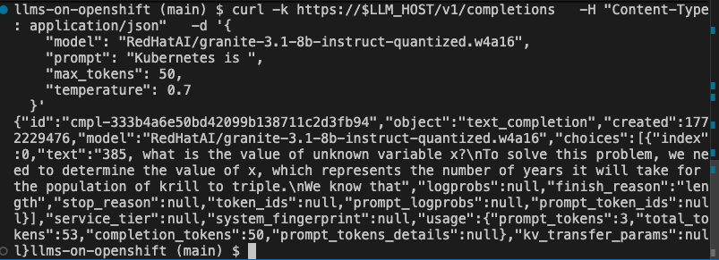
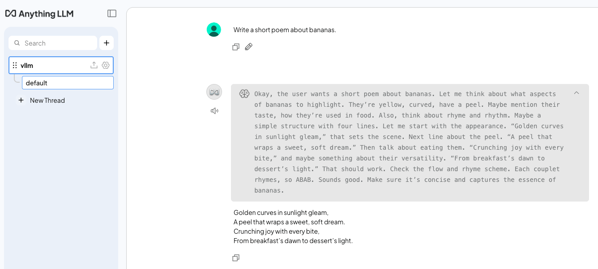

# LLMs on Kubernetes: The Easy Way


Sometimes, you just want to run a Large Language Model (LLM)... no Jupyter notebook, no training pipeline, no fancy UI. Running LLMs on Kubernetes can feel daunting: GPU drivers, custom container images, gigabytes of model downloads, and endless tuning parameters.

Of course, there are frontier model services like Claude, Gemini, and ChatGPT that are easy to use, but they are heavy, expensive, and come with privacy concerns. For many tasks, using frontier models can feel like swatting a fly with a sledgehammer.

Thankfully, there is another way! In this guide, I'll walk through the "easy way" to get a high-performance LLM up and running on Red Hat OpenShift using [Red Hat AI Inference Server](https://www.redhat.com/en/products/ai/inference-server), Red Hat's supported and optimized build of the extremely popular [vLLM](https://docs.vllm.ai/en/latest/) project. Not only is this process simple, it's also GitOps-ready and portable across clouds, on-prem data centres, and GPU providers. Let's go!

## Why Red Hat AI Inference Server (vLLM)?

[vLLM](https://docs.vllm.ai/en/latest/) has emerged as a de facto standard for open-source model serving due to its high throughput, memory efficiency, and ability to abstract away the underlying hardware. vLLM offers up to 10x the throughput of other popular serving runtimes such as Ollama along with lower latency and better concurrent request handling. 

**Red Hat AI Inference Server** packages this engine into a secure, supported container image that runs seamlessly on Red Hat OpenShift and other Kubernetes distributions. For now, I'll concentrate on Red Hat OpenShift. Since "OpenShift is OpenShift", this guide will work just as well in the cloud, in your own data centre (virtualized or on bare metal), or even in an air gapped environment (you will need to pre-download the models, of course).  This platform consistency is just one reason why OpenShift is awesome... but that's not the subject for today, so let's get going!

## Prerequisites

To follow along, you will need:

1.  **Access to an OpenShift Cluster** (4.18+ recommended).
2.  **GPU Node(s)**: At least one node with an NVidia GPU that has 16GB+ of VRAM.
3.  **Operators**: Both the "Node Feature Discovery" and "Nvidia" operators installed with default instances deployed.
4.  **OpenShift CLI (`oc`)**: Installed and logged in.
5.  **Hugging Face Token (optional)**: If you plan to use a gated model (like Llama 3).

## A Quick Note on Node Feature Discover (NFD) and Nvidia Operators

If you're unsure how to go about deploying the NFD and Nvidia operators, it's actually quite easy.  Thanks to [Bryden Stack](https://github.com/turbra/ocp-nvidia-inference/tree/main?tab=readme-ov-file#openshift-node-feature-discovery-and-nvidia-gpu-operator-deployment) for the pointers:

- Installing Node Feature Discovery Operator using the Web Console
  - Accept defaults
  - Create NodeFeatureDiscovery using Form View
    - Accept defaults
- Install Nvidia GPU Operator
  - Accept defaults
  - Create ClusterPolicy 
    - Accept defaults

## What We'll Deploy

The requirements for this demo are refreshingly simple.  All manifests are provided in this repository so you don't have to copy/paste:

1.  **Persistent Volume (PVC)**: To store the model(s) that you download from [HuggingFace](https://huggingface.co/).
2.  **Deployment**: Runs the RHOAI Inference Server container, mounts the PVC, and requests a GPU.
3.  **Service & Route**: Exposes the OpenAI-compatible API to the outside world.

## Step 1: Create a Project and Secrets

First, create a new project/namespace for this demo.

```bash
oc apply -f manifests/inference-server/granite/namespace.yaml
oc project vllm-serving
```

If you are using a gated model (like Llama 3.1), create a secret with your HuggingFace token:

```bash
oc create secret generic hf-token \
  --from-literal=token=hf_YOUR_TOKEN_HERE \
  --dry-run=client -o yaml | oc apply -f -
```

## Step 2: The Model Storage (PVC)

LLMs are huge!  However, the ones that we will test today aren't too bad... less than 10GB each. We'll create a PVC big enough to hold two models comfortably for now:

*File: `manifests/inference-server/granite/pvc.yaml`*

```yaml
apiVersion: v1
kind: PersistentVolumeClaim
metadata:
  name: model-cache
spec:
  accessModes:
    - ReadWriteOnce
  resources:
    requests:
      storage: 30Gi
```

Apply it:
```bash
oc apply -f manifests/inference-server/granite/pvc.yaml
```

## Step 3: The Deployment

This is where the magic happens. The deployment has three key settings:

*   **Image**: The RHOAI inference server image (e.g., `registry.redhat.io/rhoai/rhoai-vllm-rhel9:latest` or similar).
*   **Command**: Standard vLLM arguments like `--model`.
*   **Resources**: A single GPU (in my case an RTX 5060 Ti with 16GB VRAM)

*File: `manifests/inference-server/granite/deployment.yaml`*

```yaml
apiVersion: apps/v1
kind: Deployment
metadata:
  name: vllm-inference
  labels:
    app: vllm-inference
spec:
  strategy:
    type: Recreate
  replicas: 1
  selector:
    matchLabels:
      app: vllm-inference
  template:
    metadata:
      labels:
        app: vllm-inference
    spec:
      containers:
        - name: vllm
          image: registry.redhat.io/rhaiis/vllm-cuda-rhel9:3
          command: ["python3", "-m", "vllm.entrypoints.openai.api_server"]
          args:
            - "--model"
            - "RedHatAI/granite-3.1-8b-instruct-quantized.w4a16"  # Replace with your model
            - "--download-dir"
            - "/data"
            - '--tensor-parallel-size=1'
            - '--max-model-len=32000'
          env:
            - name: HF_HUB_OFFLINE
              value: "0"
            - name: VLLM_SERVER_DEV_MODE
              value: '1'
            - name: HUGGING_FACE_HUB_TOKEN
              valueFrom:
                secretKeyRef:
                  name: hf-token
                  key: token
                  optional: true
          ports:
            - containerPort: 8000
          resources:
            limits:
              cpu: '4'
              nvidia.com/gpu: '1'
              memory: 12Gi
            requests:
              cpu: 500m
              memory: 8Gi
              nvidia.com/gpu: '1'
          volumeMounts:
            - name: model-data
              mountPath: /data
      volumes:
        - name: model-data
          persistentVolumeClaim:
            claimName: model-cache
```

Apply it:
```bash
oc apply -f manifests/inference-server/granite/deployment.yaml
```

Easy, right?  Now, this is going to take a while since it's downloading a multi-GB model then starting the serving engine.  However, from a simplicity point of view, it's hard to beat that single YAML deployment!

You can watch vLLM start and follow the process of it loading the model onto your GPU with the following command:

```bash
oc logs -f deploy/vllm-inference
```

You will know when it's ready to accept requests when you see this line in your log:

```bash
(APIServer pid=1) INFO:     Application startup complete.
```

## Step 4: Expose the Service

Finally, expose the API so you can talk to it.

*File: `manifests/inference-server/granite/service.yaml`*

```yaml
apiVersion: v1
kind: Service
metadata:
  name: vllm-service
spec:
  selector:
    app: vllm-inference
  ports:
    - protocol: TCP
      port: 80
      targetPort: 8000
```

*File: `manifests/inference-server/granite/route.yaml`*

```yaml
apiVersion: route.openshift.io/v1
kind: Route
metadata:
  name: inference
spec:
  to:
    kind: Service
    name: vllm-service
  port:
    targetPort: 8000
  tls:
    termination: edge
```

Apply it:
```bash
oc apply -f manifests/inference-server/granite/service.yaml
oc apply -f manifests/inference-server/granite/route.yaml
```

Just like that, you're serving a model from HuggingFace with an OpenAI-compatible endpoint.  Incredible!

If you wanted to do all the above in one simple command, you could have used the `-k` option (available for both `oc` and `kubectl`) for "kustomize" to apply everything above:

```bash
oc apply -k manifests/inference-server/granite
```

Of course, if you're already familiar with GitOps then you probably already have a good idea of how you can manage this with OpenShift GitOps (Argo CD) as well.

## Step 5: Verify vLLM Is Working

The Granite model should now be deployed and running (see the command in *Step 4* to view the logs if you're unsure).

Get your route URL:

```bash
export LLM_HOST=$(oc get route inference -o jsonpath='{.spec.host}')
```

Now, test it with a simple curl command. The first request will take some time as the model "warms up", so be patient.

```bash
curl -k https://$LLM_HOST/v1/completions \
  -H "Content-Type: application/json" \
  -d '{
    "model": "RedHatAI/granite-3.1-8b-instruct-quantized.w4a16",
    "prompt": "Kubernetes is ",
    "max_tokens": 50,
    "temperature": 0.7
  }'
```



## Step 6: Try a Different Model

For fun, let's try a different model. We already have a Deployment ready to go to serve `Qwen3-8B-quantized`.  Barely anything changes in the deployment other than the model name that is referenced:

```
args:
  - "--model"
  - "RedHatAI/Qwen3-8B-quantized.w4a16"  # Replace with your model
  - "--download-dir"
  - "/data"
  - '--tensor-parallel-size=1'
```

Run the following command to restart vLLM with the new model. This will take a few moments the first time, since it needs to download the model from HuggingFace and store it in the PVC cache:

```bash
oc apply -k manifests/inference-server/qwen3
```

Again, follow the logs until you see "Application startup complete":

```bash
oc logs -f deploy/vllm-inference
```

You're now serving `Qwen3-8B-quantized.w4a16` instead of `granite-3.1-8b-instruct-quantized.w4a16`!  That was easy!

## Step 7: Add A UI

Sometimes, it's just nicer to test with a UI. Let's deploy an instance of AnythingLLM so we can chat with our model without having to craft `curl` commands.

First, copy your LLM route URL.  You can find it by running:

```
echo $LLM_HOST
```

Next, open the file `manifests/anythingllm/config-secret.yaml` and replace `<ROUTE URL>` with the output of `echo $LLM_HOST`.

Next, set the appropriate LLM name.  Uncomment the `GENERIC_OPEN_AI_MODEL_PREF` line that corresponds with the model you're currently serving. DO NOT uncomment both! If you are currently serving Qwen3, then it would look like the following:
```yaml
#GENERIC_OPEN_AI_MODEL_PREF: "RedHatAI/granite-3.1-8b-instruct-quantized.w4a16"
GENERIC_OPEN_AI_MODEL_PREF: "RedHatAI/Qwen3-8B-quantized.w4a16"
```

Finally, run the following command to deploy AnythingLLM into your `vllm-serving` namespace:

```bash
oc apply -k manifests/anythingllm
```

Once the AnythingLLM pod is healthy, access the new route and select "Send chat". Enter a name for your workspace then start chatting away with your model!  The first request might take some time as the model warms up.



And there you have it, you've deployed a model using Red Hat AI Inference Server (vLLM) and an open source UI to chat with it.  The best part?  It doesn't matter if your cluster is on AWS, Azure, Google Cloud, or in your own data centre... it's all the same! Run the models that you want to run where you want to run them.

## Conclusion

That's it! You now have a high-performance, GPU-accelerated LLM inference server running on OpenShift. That's pretty impressive if you ask me, but we can level this up even more.  I'll be following this up with more blog posts in this series to cover:

1. Enabling metrics to monitor GPU usage and vLLM performance.
2. Integrating your models into your applications, IDEs, and CI processes.
3. Scaling up to handle more traffic (spolier - this might also include [llm-d](https://llm-d.ai/)).

In the meantime, I encourage you to take a deeper dive of the [vLLM documentation](https://docs.vllm.ai/en/latest/) and read up on [Red Hat AI Inference Server](https://docs.redhat.com/en/documentation/red_hat_ai_inference_server/latest).  If this has piqued your interest, then please reach out to me or your local Red Hat team for more information on Red Hat AI Inference server.  Happy inferencing!
